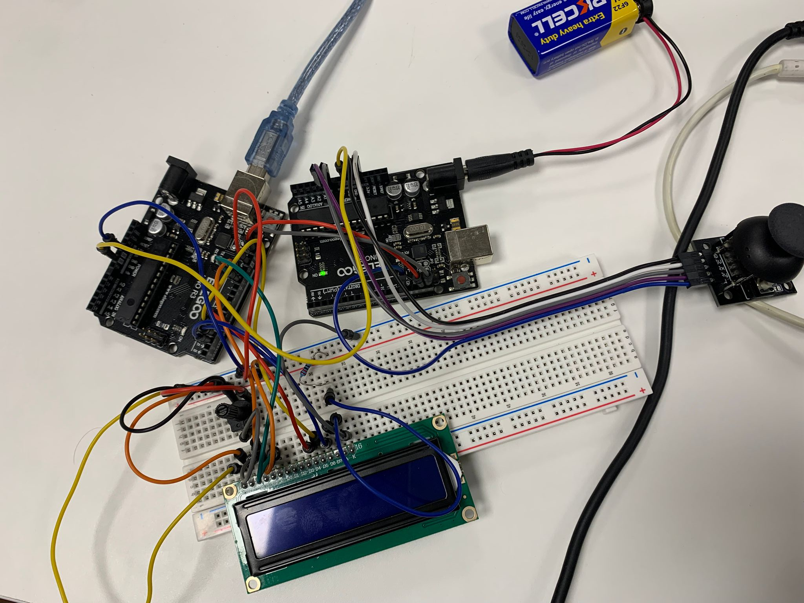

# UNO R3 platformer

This is a small platformer game I did during a weekend to learn I2C master/slave communication.

It uses two UNO R3's:

- Slave: connected to a joystick
- Master: connected to a LiquidCrystal LCD

The master requests joystick data from the slave to control the player.

## Demo

